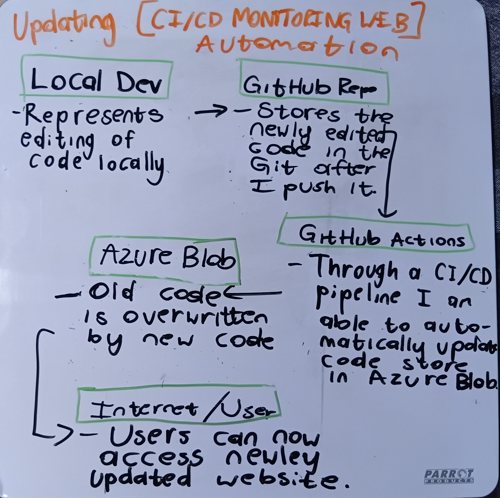

# CI/CD Pipeline Monitoring System

I developed a CI/CD pipeline monitoring system designed to improve visibility into automated deployments across cloud-based architectures.

## Background

As part of an earlier project, I implemented a CI/CD pipeline for an AWS S3-hosted static website. The pipeline allows me to develop and test changes locally, push them to a GitHub repository, and automatically deploy the updated files to an Amazon S3 bucket through GitHub Actions.

This eliminated the need to manually access AWS, locate the S3 bucket, and upload files after every change. As a result, the deployment process became more consistent, efficient, and less dependent on manual intervention.

However, while the deployment process was automated, monitoring the outcome of each pipeline still required manual intervention. To determine whether a deployment had succeeded or failed, I had to access GitHub, navigate to the Actions section, and inspect individual workflow runs. This became repetitive and inefficient, particularly during periods of frequent development and deployment.

## Solution

To address this limitation, I developed a CI/CD monitoring dashboard using Microsoft Azure services.

The system uses **Azure Functions** to communicate with the **GitHub API**, retrieve workflow information, and process the latest CI/CD run data. Information such as the workflow status, branch, and timestamps is then presented through a static frontend hosted on **Azure Blob Storage**.

This provides a centralised view of deployment activity without requiring manual navigation through GitHub.

## Architecture

The overall architecture allows the deployment pipeline and monitoring system to work together:

  

The monitoring dashboard provides visibility into whether deployments have:

* Succeeded
* Failed
* Are currently running

This makes it possible to monitor deployment activity from a single interface rather than manually checking workflow runs across different platforms.

## CI/CD Pipeline for the Monitoring Dashboard

Because the monitoring dashboard itself requires ongoing development and updates, I also implemented a CI/CD pipeline for the monitoring website.

The pipeline allows me to modify the frontend locally, commit and push the changes to the GitHub repository, and automatically deploy the updated website to Azure Blob Storage.

This means both the original application and the monitoring dashboard follow an automated development and deployment workflow.

  

## Outcome

The project demonstrates how multiple cloud services can be integrated to create an automated development and deployment workflow.

The final system provides:

* Automated application deployments
* Automated monitoring of GitHub Actions workflows
* Centralised CI/CD visibility
* Automated deployment of the monitoring dashboard
* Reduced manual deployment and monitoring tasks
* Integration between AWS, Azure, GitHub Actions, and the GitHub API

Overall, the project demonstrates practical experience with cloud infrastructure, serverless computing, APIs, CI/CD automation, and multi-cloud architecture.
