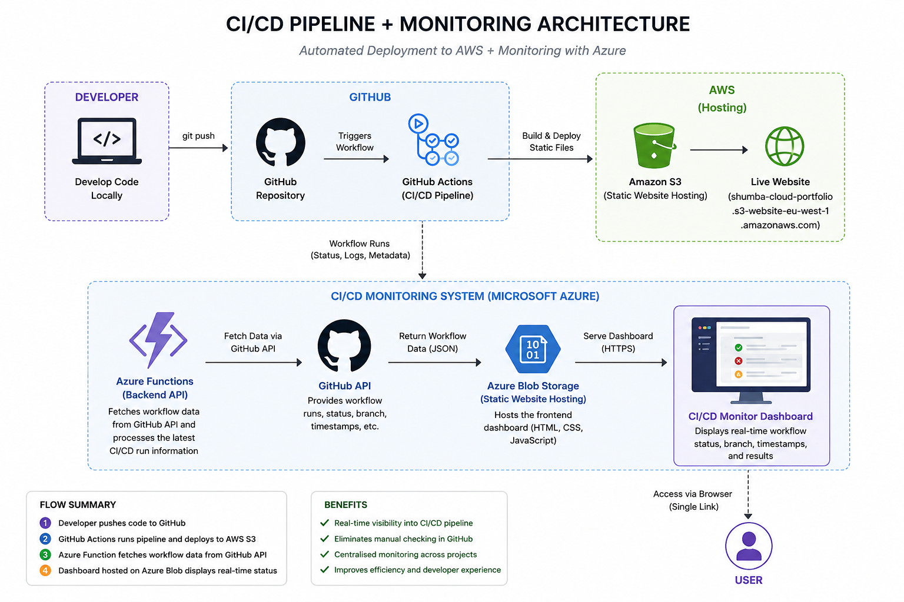

built a CI/CD pipeline monitoring system for multiple cloud architectures to improve visibility into automated deployments. Prior to this project, I created a CI/CD pipeline for an AWS S3-hosted static website (http://shumba-cloud-portfolio.s3-website-eu-west-1.amazonaws.com), which allows me to develop code locally, push changes to a GitHub repository, and automatically trigger deployment through GitHub Actions to update the S3 bucket. This removed the need to manually log into AWS, locate the S3 bucket, and upload files after each change, significantly improving deployment efficiency and reducing manual work.

Although the deployment process was automated, monitoring the outcome of each pipeline still required manual checking. To verify whether a deployment succeeded or failed, I had to log into GitHub, navigate to the Actions tab, and inspect workflow runs. This was repetitive and inefficient, especially during frequent development iterations where multiple changes were being pushed in a short period of time.

To solve this, I built a CI/CD monitoring dashboard using Microsoft Azure services. The system uses Azure Functions to fetch workflow data from the GitHub API and processes the latest CI/CD run information, including status, branch, and timestamps. This data is then displayed on a static frontend hosted on Azure Blob Storage, providing a simple and real-time view of deployment activity.

The result is a single, centralised dashboard that removes the need to manually navigate GitHub to check workflow status. Instead of logging into multiple platforms, I can now open one link and immediately see whether my deployments succeeded, failed, or are currently running. This improves visibility, reduces friction in the development workflow, and provides a more efficient way to monitor CI/CD pipelines across different cloud projects.

Here is a schematic:

  

The CI/CD monitoring website will also need to be updated time to time, so i created a ci/cd pipeline for that as well to be able to locally edit the code and push it into my repository and then it must automatically update the website hosted on Azure Blob.

Here is a schematic of the pipeline that updates the Azure hosted CI/CD monitoring website:

  

